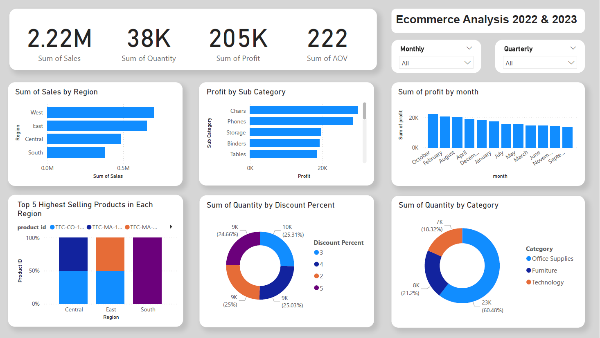

In this project, I will do end to end data analysis project using python, SQL and PowerBI. And then I will make sale forecasting using statistical modeling. First, I will use kaggle API to download dataset then I will use pandas for data cleaning, data processing and loading the cleaned data into sql server. After that, I will move on to SQL queries for analysis and create dashboard using PowerBI for making better decisions and solving issues by visualizing data in a way that's easy to understand. Finally, I will make slae forecasting for the next 12 months to provide valuable insights.

